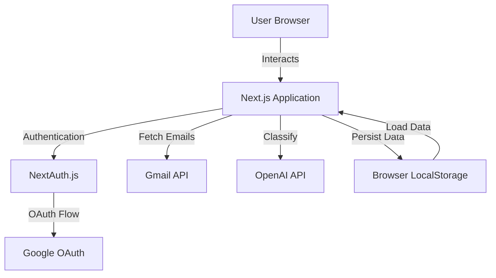

# Design Document

## Overview

The Email Classifier Application is a full-stack web application built with Next.js that enables users to authenticate via Google OAuth, fetch their Gmail emails, and automatically classify them using OpenAI's GPT-4o model. The application follows a modern architecture with server-side API routes, client-side state management, and browser-based persistence.

### Technology Stack

- **Frontend Framework**: Next.js 14+ (App Router)
- **Styling**: Tailwind CSS
- **Authentication**: NextAuth.js with Google OAuth Provider
- **API Integration**: 
  - Gmail API (via googleapis npm package)
  - OpenAI API (via Langchain.js)
- **State Management**: React hooks and Context API
- **Storage**: Browser localStorage for client-side persistence
- **Language**: TypeScript for type safety

## Architecture

### High-Level Architecture



### Application Flow

1. **Authentication Flow**
   - User lands on login page
   - Clicks "Sign in with Google"
   - Redirected to Google OAuth consent screen
   - User grants Gmail read permissions
   - Callback returns to application with tokens
   - Session established via NextAuth.js

2. **API Key Setup Flow**
   - After authentication, check localStorage for OpenAI key
   - If not present, show modal/form to collect API key
   - Validate key format (starts with "sk-")
   - Store in localStorage
   - Enable email fetching

3. **Email Fetching Flow**
   - User clicks "Fetch Emails" button
   - API route receives request with session token
   - Server exchanges session for Gmail access token
   - Call Gmail API to fetch 15 most recent messages
   - Extract message details (id, sender, subject, snippet, date)
   - Return email data to client
   - Store in localStorage

4. **Classification Flow**
   - For each fetched email, prepare classification request
   - Send email content to OpenAI via Langchain.js
   - Use structured prompt for category classification
   - Parse response and assign category
   - Update email object with category
   - Persist classified emails to localStorage

5. **Display Flow**
   - Load emails from localStorage on mount
   - Group emails by category
   - Render category sections with counts
   - Display email cards with sender, subject, date
   - Apply category-specific styling

## Components and Interfaces

### Frontend Components

#### 1. Page Components

**`app/page.tsx` - Landing/Login Page**
- Displays login button when unauthenticated
- Redirects to dashboard when authenticated
- Shows application description and features

**`app/dashboard/page.tsx` - Main Dashboard**
- Protected route (requires authentication)
- Displays email categories and counts
- Shows email list grouped by category
- Provides "Fetch Emails" and "Clear Data" actions

#### 2. Feature Components

**`components/AuthButton.tsx`**
- Handles sign in/sign out actions
- Displays user profile information
- Uses NextAuth.js session

**`components/ApiKeyModal.tsx`**
- Modal form for OpenAI API key input
- Validates key format
- Saves to localStorage
- Shows/hides based on key presence

**`components/EmailList.tsx`**
- Displays emails grouped by category
- Props: `emails: ClassifiedEmail[]`
- Renders category sections with expand/collapse
- Shows email count per category

**`components/EmailCard.tsx`**
- Individual email display card
- Props: `email: ClassifiedEmail`
- Shows sender, subject, snippet, date
- Category badge with color coding

**`components/CategorySection.tsx`**
- Collapsible section for each category
- Props: `category: EmailCategory, emails: ClassifiedEmail[], count: number`
- Category icon and color theme
- Expand/collapse functionality

**`components/LoadingSpinner.tsx`**
- Loading indicator for async operations
- Used during email fetch and classification

#### 3. Layout Components

**`components/Header.tsx`**
- Application header with logo
- User profile and sign out button
- Navigation elements

**`components/Footer.tsx`**
- Application footer with links
- Copyright and attribution

### Backend API Routes

**`app/api/auth/[...nextauth]/route.ts`**
- NextAuth.js configuration
- Google OAuth provider setup
- Session management
- Scopes: `gmail.readonly`, `userinfo.email`, `userinfo.profile`

**`app/api/emails/fetch/route.ts`**
- POST endpoint to fetch emails
- Requires authenticated session
- Calls Gmail API with user's access token
- Returns array of email objects
- Error handling for API failures

**`app/api/emails/classify/route.ts`**
- POST endpoint to classify emails
- Receives: `emails: Email[], openaiKey: string`
- Uses Langchain.js to call OpenAI
- Returns: `ClassifiedEmail[]`
- Batch processing for efficiency

### Type Definitions

```typescript
// types/email.ts

export type EmailCategory = 
  | 'Important'
  | 'Promotional'
  | 'Social'
  | 'Marketing'
  | 'Spam'
  | 'General';

export interface Email {
  id: string;
  sender: string;
  subject: string;
  snippet: string;
  date: string;
  body?: string;
}

export interface ClassifiedEmail extends Email {
  category: EmailCategory;
}

export interface FetchEmailsResponse {
  emails: Email[];
  success: boolean;
  error?: string;
}

export interface ClassifyEmailsRequest {
  emails: Email[];
  openaiKey: string;
}

export interface ClassifyEmailsResponse {
  classifiedEmails: ClassifiedEmail[];
  success: boolean;
  error?: string;
}
```

## Data Models

### Email Data Structure

The application works with email objects that contain essential metadata:

```typescript
{
  id: "msg_12345",
  sender: "john@example.com",
  subject: "Meeting Tomorrow",
  snippet: "Hi, just confirming our meeting...",
  date: "2025-10-27T10:30:00Z",
  category: "Important"
}
```

### LocalStorage Schema

**Key: `openai_api_key`**
- Type: string
- Value: User's OpenAI API key

**Key: `classified_emails`**
- Type: JSON string
- Value: Array of ClassifiedEmail objects

**Key: `last_fetch_time`**
- Type: string (ISO timestamp)
- Value: Timestamp of last email fetch

### Session Data

NextAuth.js manages session data including:
- User profile (name, email, image)
- Access token for Gmail API
- Refresh token for token renewal
- Token expiry time

## API Integration Details

### Google OAuth Setup

**Required Configuration:**
- Google Cloud Console project
- OAuth 2.0 Client ID credentials
- Authorized redirect URIs: `http://localhost:3000/api/auth/callback/google`
- Required scopes:
  - `https://www.googleapis.com/auth/gmail.readonly`
  - `https://www.googleapis.com/auth/userinfo.email`
  - `https://www.googleapis.com/auth/userinfo.profile`

**Test Users:**
- Add `theindianappguy@gmail.com` as test user in Google Cloud Console
- Navigate to OAuth consent screen → Test users → Add users

### Gmail API Integration

**Endpoint Used:** `gmail.users.messages.list` and `gmail.users.messages.get`

**Request Flow:**
1. List messages: `GET /gmail/v1/users/me/messages?maxResults=15`
2. For each message ID, get details: `GET /gmail/v1/users/me/messages/{id}`
3. Parse headers for sender, subject, date
4. Extract snippet or body text

**Authentication:**
- Use access token from NextAuth session
- Handle token refresh automatically via NextAuth

### OpenAI Integration via Langchain.js

**Model:** GPT-4o

**Classification Prompt Template:**
```
Classify the following email into one of these categories: Important, Promotional, Social, Marketing, Spam, or General.

Email Details:
From: {sender}
Subject: {subject}
Content: {snippet}

Category Definitions:
- Important: Personal or work-related emails requiring immediate attention
- Promotional: Sales, discounts, and promotional campaigns
- Social: Social networks, friends, and family
- Marketing: Marketing emails, newsletters, and notifications
- Spam: Unwanted or unsolicited emails
- General: Emails that don't fit other categories

Respond with only the category name.
```

**Langchain.js Implementation:**
```typescript
import { ChatOpenAI } from "@langchain/openai";
import { PromptTemplate } from "@langchain/core/prompts";

const model = new ChatOpenAI({
  modelName: "gpt-4o",
  openAIApiKey: userProvidedKey,
  temperature: 0.3,
});

const prompt = PromptTemplate.fromTemplate(classificationPromptTemplate);
const chain = prompt.pipe(model);
```

## Error Handling

### Authentication Errors

**Scenario:** OAuth flow fails or user denies permissions
- **Handling:** Display error message on login page
- **User Action:** Retry authentication
- **Logging:** Log error details to console

**Scenario:** Session expires
- **Handling:** Redirect to login page
- **User Action:** Re-authenticate
- **Logging:** Clear session data

### API Errors

**Gmail API Errors:**
- **401 Unauthorized:** Token expired → Trigger token refresh
- **403 Forbidden:** Insufficient permissions → Show permission error
- **429 Rate Limit:** Too many requests → Show retry message with delay
- **500 Server Error:** Gmail service issue → Show error, suggest retry

**OpenAI API Errors:**
- **401 Unauthorized:** Invalid API key → Prompt user to re-enter key
- **429 Rate Limit:** Quota exceeded → Show error, suggest waiting
- **500 Server Error:** OpenAI service issue → Fallback to "General" category

### Client-Side Errors

**LocalStorage Errors:**
- **QuotaExceededError:** Storage full → Clear old data, notify user
- **SecurityError:** Storage blocked → Show warning about browser settings

**Network Errors:**
- **Timeout:** Request takes too long → Show timeout message, retry option
- **No Connection:** Offline → Show offline indicator, disable fetch

### Error Display Strategy

- Use toast notifications for non-critical errors
- Use modal dialogs for critical errors requiring user action
- Provide clear error messages with actionable steps
- Log all errors to console for debugging

## Testing Strategy

### Unit Tests

**Components to Test:**
- `EmailCard`: Renders email data correctly
- `CategorySection`: Groups emails by category
- `ApiKeyModal`: Validates and stores API key
- Utility functions: Email parsing, date formatting

**Tools:** Jest, React Testing Library

### Integration Tests

**Flows to Test:**
- Authentication flow: Login → Session creation → Redirect
- Email fetch flow: API call → Data parsing → LocalStorage
- Classification flow: OpenAI call → Category assignment → Display

**Tools:** Jest, MSW (Mock Service Worker) for API mocking

### API Route Tests

**Endpoints to Test:**
- `/api/emails/fetch`: Returns correct email format
- `/api/emails/classify`: Returns classified emails
- Error handling for invalid tokens/keys

**Tools:** Jest, node-mocks-http

### End-to-End Tests

**Critical Paths:**
1. Complete user journey: Login → Enter API key → Fetch emails → View classified emails
2. Persistence: Refresh page → Data loads from localStorage
3. Error recovery: Invalid API key → Re-enter → Success

**Tools:** Playwright or Cypress (optional for this assignment)

### Manual Testing Checklist

- [ ] Google OAuth login works
- [ ] API key modal appears for new users
- [ ] API key persists in localStorage
- [ ] Fetch emails retrieves 15 messages
- [ ] All emails are classified into categories
- [ ] Category counts are accurate
- [ ] Emails display with correct formatting
- [ ] Page refresh loads cached data
- [ ] Clear data button works
- [ ] Logout clears session but keeps localStorage
- [ ] Responsive design works on mobile
- [ ] Error messages display appropriately

## Security Considerations

### API Key Storage

- OpenAI API key stored in localStorage (client-side only)
- Never send API key to backend or log it
- Warn users about key security in UI

### OAuth Token Handling

- Access tokens managed by NextAuth.js
- Tokens stored in secure HTTP-only cookies
- Automatic token refresh before expiry
- Never expose tokens in client-side code

### Data Privacy

- No email data sent to backend database
- All email storage is client-side (localStorage)
- Users can clear data at any time
- No analytics or tracking of email content

### Environment Variables

- Store sensitive credentials in `.env.local`
- Never commit `.env.local` to version control
- Use `.env.example` for documentation

## Performance Optimization

### Email Fetching

- Limit to 15 emails to reduce API calls
- Batch classification requests when possible
- Cache results in localStorage to avoid re-fetching

### UI Rendering

- Use React.memo for email cards to prevent unnecessary re-renders
- Implement virtual scrolling if email list grows
- Lazy load email bodies only when expanded

### API Calls

- Debounce user actions (e.g., fetch button)
- Show loading states during async operations
- Implement request cancellation for abandoned operations

## Deployment Considerations

### Environment Setup

**Required Environment Variables:**
```
GOOGLE_CLIENT_ID=your_client_id
GOOGLE_CLIENT_SECRET=your_client_secret
NEXTAUTH_URL=http://localhost:3000
NEXTAUTH_SECRET=your_random_secret
```

### Build Process

```bash
npm run build
npm run start
```

### Hosting Options

- Vercel (recommended for Next.js)
- Netlify
- AWS Amplify
- Self-hosted Node.js server

### Pre-Deployment Checklist

- [ ] Add test users in Google Cloud Console
- [ ] Configure OAuth redirect URIs for production domain
- [ ] Set environment variables in hosting platform
- [ ] Test OAuth flow in production environment
- [ ] Verify Gmail API quota limits
- [ ] Document setup process in README

## Documentation Requirements

### README.md Structure

1. **Project Overview**: Brief description of the application
2. **Features**: List of key features
3. **Tech Stack**: Technologies used
4. **Prerequisites**: Node.js version, accounts needed
5. **Setup Instructions**:
   - Clone repository
   - Install dependencies
   - Configure Google OAuth
   - Set environment variables
   - Run development server
6. **Google OAuth Setup**: Step-by-step guide with screenshots
7. **Adding Test Users**: Instructions for adding theindianappguy@gmail.com
8. **Usage Guide**: How to use the application
9. **Project Structure**: Directory layout explanation
10. **Troubleshooting**: Common issues and solutions
11. **License**: MIT or appropriate license

### Code Documentation

- JSDoc comments for all functions and components
- Inline comments for complex logic
- Type definitions with descriptions
- API route documentation with request/response examples

## Future Enhancements (Out of Scope)

- Email search and filtering
- Custom category creation
- Email actions (archive, delete, reply)
- Multi-account support
- Backend database for persistence
- Email threading and conversations
- Attachment handling
- Desktop notifications
- Dark mode theme
